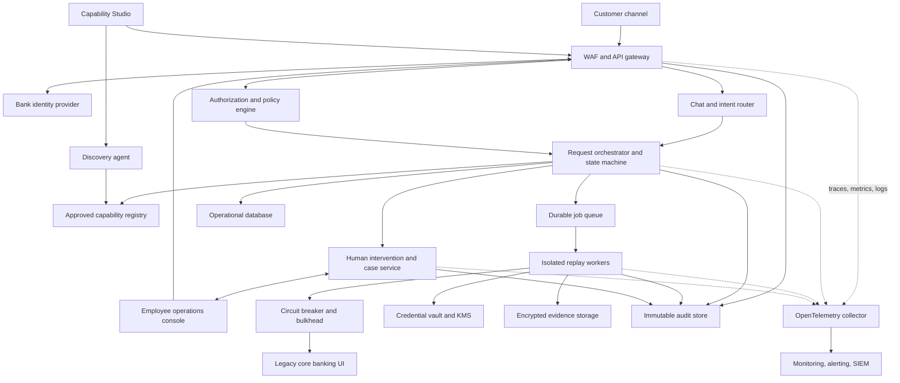

# MERIDIAN Assist — production architecture

## Product boundary

MERIDIAN Assist is a customer-facing banking assistant backed by deterministic
automation of approved legacy-core workflows. Bank employees use an operations
console to review runs, resolve issues, approve sensitive steps, take over a
live session, and inspect the correlated audit trail. An internal Capability
Studio uses the discovery LLM to create draft workflows; discovery is never in
the customer transaction path.

The key rule is:

> The LLM may understand intent and discover a workflow, but deterministic
> services and bank policy control identity, authorization, money movement,
> approval, and final transaction status.

## Logical architecture



These boxes are logical boundaries, not a requirement to deploy every box as a
separate microservice on day one. The first production shape should be a
modular control-plane application plus a durable queue and an isolated browser
worker tier.

## Customer request lifecycle

1. The bank authenticates the customer using OIDC and MFA where required.
2. The gateway validates the short-lived access token, rate limit, request
   schema, and correlation ID.
3. The intent router selects an approved capability. It never receives legacy
   credentials and cannot authorize an action.
4. The policy engine verifies customer/account ownership, capability scope,
   transaction limits, fraud signals, and required authentication strength.
5. The orchestrator requests customer confirmation and employee approval when
   policy requires it.
6. A durable job is claimed by an isolated replay worker.
7. The worker obtains a short-lived legacy credential from the vault, executes
   the approved artifact without an LLM, and verifies every checkpoint.
8. The result is returned to the customer or paused as an employee case.
9. Audit events and redacted evidence are retained independently of application
   logs.

## Discovery and capability lifecycle

```text
Draft goal -> supervised discovery -> generated artifact -> automated tests
-> risk review -> business review -> approved version -> staged rollout
-> monitored replay -> revalidation or rollback
```

Discovery uses test or synthetic customers. A discovered capability cannot be
called by a customer until it is reviewed, signed, versioned, and published.
UI drift creates a new draft or tenant overlay; it never silently rewrites an
approved artifact.

## Request state machine

```text
RECEIVED -> AUTHORIZED -> CONFIRMATION_REQUIRED -> QUEUED -> RUNNING
RUNNING -> SUCCEEDED | BUSINESS_OUTCOME | WAITING_HUMAN | FAILED
RUNNING -> EFFECT_UNKNOWN -> RECONCILING -> SUCCEEDED | FAILED
WAITING_HUMAN -> RUNNING | DENIED | CANCELLED
```

`EFFECT_UNKNOWN` is mandatory for financial writes. If the system submits a
transfer but loses the confirmation response, it must reconcile with the core
system before any retry.

## Cross-cutting enforcement chain

### Edge

- WAF and DDoS controls
- JWT validation and token replay protection
- distributed rate limiting by IP, device, customer, tenant, and endpoint
- request size and schema limits
- correlation/request ID
- TLS and security headers

### Application

- object- and function-level authorization
- tenant/customer context
- input validation and output minimization
- idempotency for every mutation
- timeouts, cancellation, retry budgets, and standardized error mapping
- structured redacted logs and distributed tracing
- feature flags and staged capability rollout

### Replay runtime

- approved artifact and policy version verification
- explicit read/reversible-write/irreversible-write classification
- customer confirmation and employee approval enforcement
- isolated credentials and egress allowlist
- per-step checkpoints and bounded recovery
- no blind retry after a possibly committed mutation

## Rate limiting and concurrency

Limits are independent and cost-aware: chat messages, OTP attempts, discovery
runs, browser concurrency, read capabilities, and financial mutations have
different budgets. Browser workers are bulkheaded by tenant and target system
so one failing bank integration cannot exhaust the entire platform.

The submission service includes a process-local limiter to make the principle
executable. Production uses the API gateway and a shared store such as Redis.

## Caching

Safe candidates include immutable capability versions, capability catalog,
public FAQs, configuration, and identity-provider signing keys. Customer
financial data requires bank-approved TTLs, encryption, permission-aware cache
keys, an `as of` timestamp, and invalidation after writes. Transaction success,
credentials, tokens, OTPs, and approval decisions are never satisfied from a
stale cache.

## Circuit breakers and fallbacks

Circuit breakers are isolated per dependency and tenant. An open legacy-system
circuit fails fast and prevents unbounded browser queues. An LLM outage falls
back to a structured service menu or employee handoff. An authentication outage
fails closed. A notification outage uses a durable outbox. No fallback may
invent a balance, approval, or transaction result.

Retries use exponential backoff with jitter and a deadline. Authentication,
authorization, business rejections, and possibly committed mutations are not
automatically retried.

## Logging, monitoring, and audit

Operational logs, customer conversation/evidence, and banking audit records are
three different data products with different access and retention rules.

Every request carries `request_id`, `trace_id`, `run_id`, tenant, actor type,
capability ID/version, policy version, and result code. Logs never contain JWTs,
passwords, OTPs, or raw legacy credentials. Metrics avoid customer/account IDs
as labels.

Alerts cover queue age, capability success rate, degraded locators, checkpoint
failures, circuit state, human-approval age, suspicious authorization failures,
and every `EFFECT_UNKNOWN` result.

## Submission deployment versus production

The container deployment is intentionally one process: the catalog, customer
assistant, operations console, and live replay state are easy to demonstrate.
It includes structured request logs, request IDs, security headers, a TTL
catalog cache, a rate limiter, router circuit breaker, secret binding, and
idempotency support.

Because the submission surfaces are not connected to a bank identity provider,
the public deployment is forced into read-only mode. Write capabilities and
employee commands return a fail-closed response. The full approval flow is for
a private/local demonstration with synthetic data only.

Before a real-bank launch, process-local runs, rate limits, idempotency records,
and console queues must move to durable/shared infrastructure. Authentication
must integrate with the bank IdP, evidence must move to encrypted object
storage, audit events to an immutable store, and browsers to separately scaled
workers. The submission deployment must not be represented as a certified
bank-production environment.
