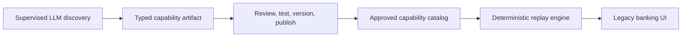
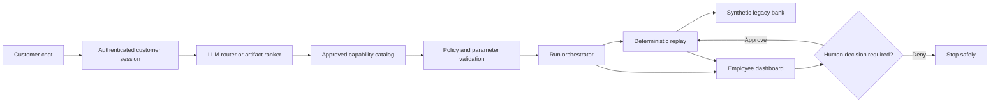

# MERIDIAN CORE

**A safe banking assistant that turns a customer's plain-language request into an approved, deterministic legacy-core workflow—with employee oversight for sensitive actions.**

MERIDIAN CORE combines three product surfaces:

- a customer banking experience with an intent-aware assistant;
- an employee operations console for approvals, exceptions, history, and evidence;
- a discovery system that records approved browser workflows as typed, versioned capability artifacts.

The central rule is simple:

> The LLM may understand intent and help discover a workflow. It never authorizes, executes, or invents the result of a banking transaction.

## Live product

| Surface | Link | Demo access |
| --- | --- | --- |
| Customer banking assistant | [Open customer site](https://meridian-automation-demo.onrender.com/customer/home) | Member `100987`, password `password` |
| Employee operations console | [Open employee console](https://meridian-automation-demo.onrender.com/) | Supervisor `super1`, password `password` |
| Employee sign-in | [Open employee login](https://meridian-automation-demo.onrender.com/employee/login) | `teller1` or `super1`, password `password` |
| Service readiness | [View readiness](https://meridian-automation-demo.onrender.com/readyz) | No login required |

The first request may take a short time while the free Render service wakes up.

> **Safety notice:** the hosted submission is a synthetic banking demo. It contains no real customer data and cannot move real money. Write workflows run only against the bundled fake bank and pause for an authenticated employee decision at the commit step.

## What to try

Log in as customer `100987`, open the assistant, and try:

```text
What is my account name?
Check the balance for account 100987-MMKT-11
Show recent transactions for account 100987-MMKT-11
Transfer $25 from 100987-MMKT-11 to 100987-S0001-9
Place a hold on account 100987-S0001-9
Show available banking capabilities
```

Read requests complete automatically. Write requests create a visible run, progress to the employee queue, and pause before the irreversible action. Sign in to the employee console to inspect the timeline and approve or deny the request.

The assistant shows approved services five at a time. **Show more options** reveals the next five without flooding the chat.

## Core idea: discover once, replay many times

Legacy banking systems often have critical workflows but no usable API. MERIDIAN CORE converts a successful browser workflow into a controlled service:



1. A supervised discovery agent uses an LLM and Playwright against test or synthetic data.
2. The successful action sequence is recorded as a typed JSON artifact with parameters, locator fallbacks, checkpoints, expected outcomes, recovery rules, and risk classifications.
3. The artifact is reviewed, tested, versioned, and published to the approved catalog.
4. Customer requests can invoke only published artifacts.
5. The replay engine performs the approved steps with **no LLM in the execution loop**.

The discovery implementation is in [`cua/discovery/`](cua/discovery/), the artifact contract is in [`cua/schema.py`](cua/schema.py), and deterministic execution is in [`cua/replay/`](cua/replay/).

## Where the LLM is used

There are two deliberately separated uses:

| Stage | LLM responsibility | What the LLM cannot do |
| --- | --- | --- |
| Capability discovery | Explore a test UI and propose a reusable workflow artifact | Publish its own artifact or bypass review/policy |
| Customer intent routing | Rank the approved artifacts and extract typed arguments | Access legacy credentials, authorize a write, control the browser, or declare transaction success |

When `ANTHROPIC_API_KEY` is configured, the chat router uses one tool-selection call over the session-scoped approved catalog. If the provider is unavailable—or no key is configured—the service falls back to a local artifact relevance ranker. Ambiguous requests produce a specific clarification question instead of a guessed action.

The public hosted demo intentionally works without an LLM key. Its deterministic fallback searches and ranks the same approved capability artifacts, so provider failure does not make approved banking services unavailable.

## Customer request lifecycle



For every request:

1. The logged-in member identity is bound on the server; the chatbot does not accept a different `member_id` from message text.
2. The router searches only capabilities approved for that member's backend.
3. Required account IDs and typed inputs are validated before execution.
4. A run is created immediately, making `routing`, `running`, `waiting for employee`, `completed`, and `failed` states visible to employees.
5. Read-only capabilities replay automatically.
6. Sensitive writes pause at the actual commit step for confirmation or employee review.
7. The result, timeline, redacted logs, and screenshot evidence remain correlated by run ID.

## Employee operations console

The dashboard is designed for bank operations teams, not automation engineers. It provides:

- live counts for running, waiting, completed, and investigation-required runs;
- a priority-ordered human intervention queue;
- approve, deny, resume, abort, and manual-intervention controls;
- plain-language run summaries with technical details available on demand;
- chronological history and a per-step execution trail;
- redacted events and screenshots for investigation;
- an approved capability catalog with friendly names, risk, type, and approval requirements.

Only an authenticated employee session can take an action. The public catalog and history can be inspected without granting approval authority.

## Approved capability catalog

The same engine drives two different browser targets with **17 recorded capabilities**.

### MERIDIAN CORE target

| Capability | Type |
| --- | --- |
| Sign on | Read/session |
| Member inquiry | Read |
| Member share balance | Read |
| Funds transfer | Write + employee approval |
| Update member information | Write + employee approval |
| Open a new share | Write + employee approval |
| Place an account hold | Restricted write + supervisor review |

### Bundled synthetic bank

| Capability | Type |
| --- | --- |
| Member inquiry | Read |
| Account balance | Read |
| Transaction history | Read |
| Funds transfer | Write + employee approval |
| Update contact information | Write + employee approval |
| Close a zero-balance account | Write + employee approval |
| Lock a card | Write + employee approval |
| Submit a loan application | Write + employee approval |
| Pay a bill | Write + employee approval |
| Place an account hold | Restricted write + employee approval |

Each catalog entry is a versioned artifact in [`artifacts/`](artifacts/), not a prompt-only tool definition.

## Safety and reliability implemented in this submission

- server-bound customer identity and backend scope;
- infrastructure-bound legacy credentials excluded from chat and public tool schemas;
- allowlisted, versioned capability artifacts;
- read/reversible-write/irreversible-write risk classification;
- employee approval at the real commit step;
- idempotency keys for mutating API calls;
- identity-anchored table locators that fail safely instead of reading a different account row;
- bounded retries and recovery rules—never a blind retry after a possibly committed write;
- endpoint rate limiting;
- short-lived capability-catalog caching;
- a circuit breaker around the external LLM router;
- deterministic routing fallback and clear clarification prompts;
- structured request logs, request IDs, redaction, and security headers;
- health and readiness probes;
- fail-closed error handling with customer-safe messages;
- synthetic-only public writes and separation from real-bank credentials.

### Result model

Every run ends in a meaningful operational state:

- **Success** — checkpoints and declared outputs were verified.
- **Business outcome** — expected rejection such as insufficient funds, member not found, or a held account.
- **Recoverable condition** — a bounded recovery rule handled UI drift or an interstitial.
- **Waiting for employee** — policy requires a person before the next step.
- **Hard failure** — execution stopped with the failed step, expected state, observed state, and evidence.

A real financial write must also support an `EFFECT_UNKNOWN` reconciliation state when submission may have succeeded but confirmation was lost. The target design covers this in [`ARCHITECTURE.md`](ARCHITECTURE.md).

## Production architecture and scaling

This repository is a **production-shaped reference implementation**, not a certified bank-production deployment. It demonstrates the control model, execution engine, and product workflow in one deployable container.

| Concern | Submission implementation | Required for a real bank rollout |
| --- | --- | --- |
| Authentication | Demo customer and employee sessions | Bank OIDC, short-lived JWT validation on every request, MFA/step-up auth, token replay protection |
| Authorization | Session-bound customer identity and employee action gate | Tenant-aware RBAC/ABAC, account ownership checks, transaction limits, fraud/risk policy |
| Rate limiting | Process-local endpoint limiter | API gateway/WAF plus shared Redis limits by tenant, customer, device, IP, endpoint, and operation cost |
| Caching | Process-local TTL catalog cache | Encrypted, permission-aware distributed cache with bank-approved TTL and write invalidation |
| Workflow state | In-memory run and approval state | Durable database, workflow engine, shared idempotency store, and durable job queue |
| Browser execution | Container-local Chromium | Horizontally scaled isolated workers, tenant bulkheads, autoscaling, workload identity, and egress allowlists |
| Resilience | Timeouts, bounded recovery, LLM circuit breaker, safe fallback | Per-dependency breakers, retry budgets, dead-letter handling, reconciliation, multi-zone recovery |
| Logging | Structured redacted logs and correlated evidence | OpenTelemetry, centralized log platform, immutable audit store, encrypted object storage, SIEM alerts |
| Secrets | Environment-injected demo credentials | Vault/KMS, short-lived credentials, rotation, least privilege, no secrets in app memory longer than needed |
| Operations | Health/readiness checks and employee queue | SLOs, alerting, on-call runbooks, backups, disaster recovery, drift monitoring, capacity tests |
| Governance | Reviewed capability files and policy gates | Signed artifact registry, maker-checker approval, staged rollout, rollback, retention and compliance controls |

The detailed target design—including JWT, circuit breakers, caching boundaries, observability, centralized audit, worker isolation, and the request state machine—is documented in [`ARCHITECTURE.md`](ARCHITECTURE.md).

## API surface

```text
GET  /healthz
GET  /readyz
GET  /api/capabilities
POST /api/capabilities/{capability_id}/invoke
GET  /api/runs
GET  /api/runs/{run_id}
POST /api/runs/{run_id}/command
POST /api/chat
```

Mutating capability calls require an `Idempotency-Key`. Employee run commands require an authenticated employee session.

## Run locally

### Requirements

- Python 3.12+
- Chromium/Chrome or Playwright Chromium

### Setup

```bash
python3.12 -m venv .venv
source .venv/bin/activate
pip install -r requirements.txt
playwright install chromium
cp .env.example .env
```

Start the bundled synthetic bank:

```bash
python -m mock_app.app
```

In a second terminal, start the product service:

```bash
source .venv/bin/activate
python -m meridian_service.app
```

Open:

- Customer: <http://127.0.0.1:5077/customer/home>
- Employee console: <http://127.0.0.1:5077/>
- Employee sign-in: <http://127.0.0.1:5077/employee/login>

An Anthropic API key is optional for the product demo. Without one, chat uses the deterministic artifact ranker. It is required only when running a new LLM discovery session.

## Discover and replay a capability

Create a capability artifact with supervised discovery:

```bash
python -m cua discover \
  --spec specs/open_sub_account.json \
  --out artifacts/open_sub_account.json \
  --approve-risky
```

Replay the recorded artifact with different inputs and no LLM:

```bash
python -m cua replay artifacts/open_sub_account.json \
  --param member_id=10456 \
  --param product_type="Money Market" \
  --param nickname="Emergency fund" \
  --param initial_deposit=50.00 \
  --confirm-risky
```

List published artifacts:

```bash
python -m cua catalog
```

Every discovery and replay run writes structured evidence beneath `runs/<run_id>/`. Committed examples are available in [`evidence/`](evidence/).

## Tests

The test suite runs without an API key or network access:

```bash
pytest -q
```

It covers artifact validation, discovery recording, deterministic replay, business outcomes, recovery, escalation, authentication boundaries, session scoping, rate limiting, caching, circuit breaking, redaction, idempotency, and public-demo safety.

## Deployment

The repository includes a Playwright-ready [`Dockerfile`](Dockerfile) and [`render.yaml`](render.yaml). The Render Blueprint builds the web service, launches the bundled synthetic bank, and exposes `/healthz` and `/readyz`.

```bash
docker build -t meridian-automation-demo .
docker run --rm -p 10000:10000 --env-file .env meridian-automation-demo
```

Keep `PUBLIC_DEMO_READ_ONLY=true`, `PUBLIC_DEMO_SYNTHETIC=true`, and `PUBLIC_DEMO_ALLOW_SYNTHETIC_WRITES=true` together for the hosted submission. This combination permits employee-approved writes only against the co-located fake bank. Never configure real bank credentials on that deployment.

See [`DEPLOYMENT.md`](DEPLOYMENT.md) for deployment details.

## Repository map

```text
cua/schema.py          Typed capability artifact contract
cua/discovery/         LLM discovery agent and recorder
cua/replay/            Deterministic replay engine and result model
cua/safety/            Policy gate and redaction
cua/escalation/        Human intervention and browser-session handoff
meridian_service/      Customer site, chat router, API, and employee console
mock_app/              Bundled synthetic legacy banking system
artifacts/             17 approved, versioned capability artifacts
specs/                 Discovery goal specifications
evidence/              Committed discovery and replay evidence
tests/                 Hermetic automated test suite
```

## Design documents

- [`REPORT.md`](REPORT.md) — implementation decisions and take-home analysis
- [`ARCHITECTURE.md`](ARCHITECTURE.md) — real-bank target architecture
- [`ADAPTATION.md`](ADAPTATION.md) — adapting the engine to a second legacy UI
- [`DEPLOYMENT.md`](DEPLOYMENT.md) — Docker and Render deployment
- [`SUBMISSION.md`](SUBMISSION.md) — five-minute reviewer walkthrough

## Current limitations

- Customer and employee passwords are demo credentials, not bank authentication.
- Run state, rate-limit state, idempotency records, and approvals are process-local.
- Evidence is stored on the container filesystem rather than encrypted durable storage.
- The hosted demo uses one web process so live intervention state remains coherent.
- Browser workers are not yet separated into an autoscaled worker tier.
- Repeated transaction descriptions can make the synthetic transaction-history row locator ambiguous because the legacy table has no unique transaction-row identifier.

These limitations are explicit so the demo can be evaluated honestly: the safety model is implemented, while the remaining infrastructure work for a real financial institution is clearly separated and documented.
